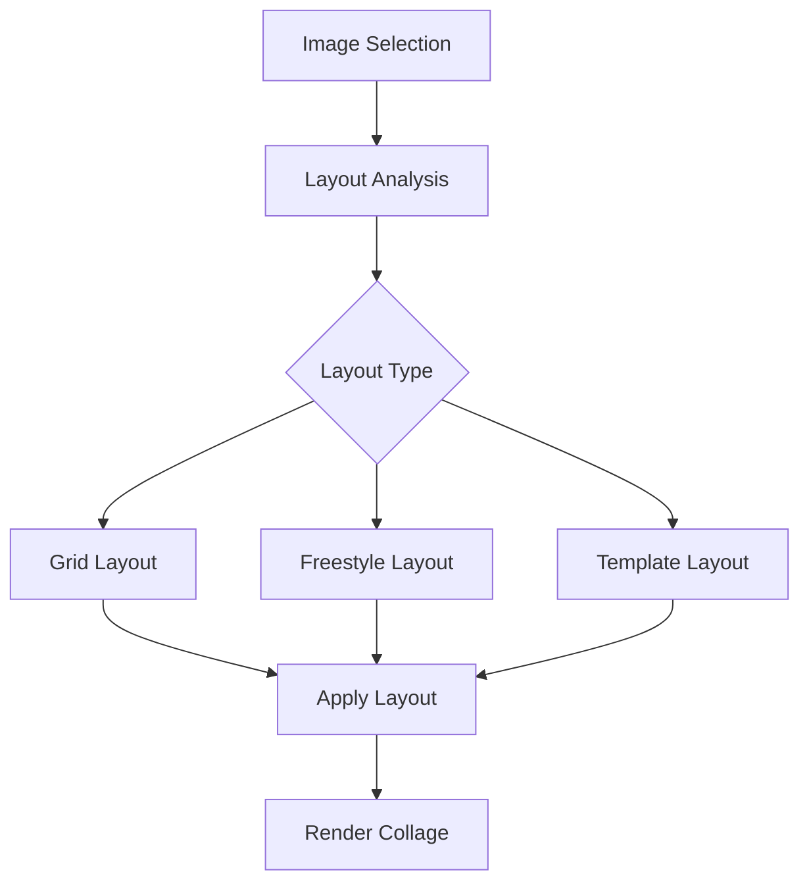
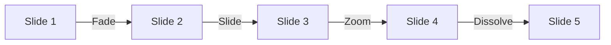
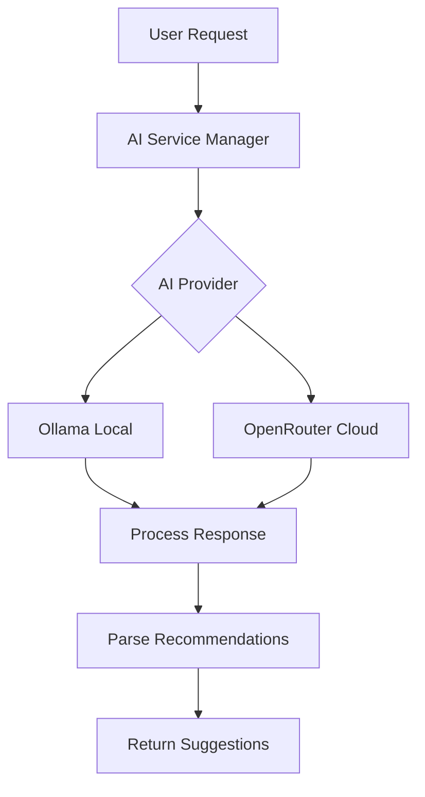
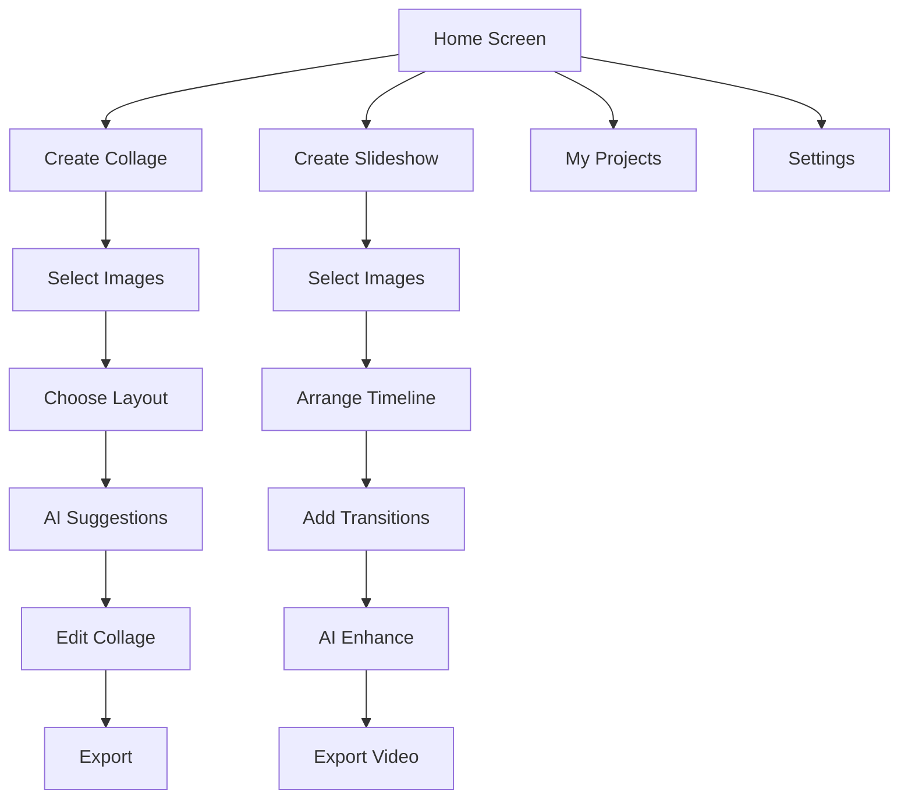

# SZ Pic - Collage & Slideshow App Architecture

## Overview
SZ Pic is a cross-platform mobile application for creating AI-enhanced collages and slideshows. The app leverages AI services (both local Ollama and cloud OpenRouter) to provide creative recommendations for layouts, themes, and compositions.

## Technology Stack

### Framework
- **Flutter**: Cross-platform framework (Android, iOS, Web)
- **Dart**: Programming language
- **Target SDK**: Android 24+ (Android 7.0 Nougat and above)

### Key Dependencies
```yaml
# State Management
- provider or riverpod (state management)
- flutter_bloc (optional, for complex state)

# Image Processing
- image_picker (gallery/camera access)
- image (image manipulation)
- photo_view (image viewing/zooming)
- image_cropper (cropping functionality)

# AI Integration
- http or dio (API requests)
- json_annotation (JSON serialization)

# Storage
- sqflite (local database)
- shared_preferences (settings)
- path_provider (file paths)

# UI/UX
- flutter_staggered_grid_view (collage layouts)
- carousel_slider (slideshow previews)
- animated_text_kit (transitions)
- flutter_colorpicker (theme selection)

# Export
- path_provider (file system access)
- share_plus (sharing functionality)
- video_player (slideshow preview)
- ffmpeg_kit_flutter (video generation for slideshows)
```

## Architecture Pattern

### Clean Architecture with Feature-Based Organization

```
lib/
├── core/
│   ├── constants/
│   │   ├── app_constants.dart
│   │   ├── layout_templates.dart
│   │   └── theme_presets.dart
│   ├── network/
│   │   ├── api_client.dart
│   │   └── api_endpoints.dart
│   ├── storage/
│   │   ├── local_database.dart
│   │   └── preferences_service.dart
│   ├── utils/
│   │   ├── image_utils.dart
│   │   ├── color_analyzer.dart
│   │   └── error_handler.dart
│   └── widgets/
│       ├── loading_indicator.dart
│       ├── error_widget.dart
│       └── custom_dialogs.dart
│
├── features/
│   ├── home/
│   │   ├── data/
│   │   ├── domain/
│   │   └── presentation/
│   │       ├── screens/
│   │       │   └── home_screen.dart
│   │       ├── widgets/
│   │       └── providers/
│   │
│   ├── collage/
│   │   ├── data/
│   │   │   ├── models/
│   │   │   │   ├── collage_project.dart
│   │   │   │   ├── collage_layout.dart
│   │   │   │   └── image_item.dart
│   │   │   └── repositories/
│   │   │       └── collage_repository.dart
│   │   ├── domain/
│   │   │   ├── entities/
│   │   │   └── usecases/
│   │   │       ├── create_collage.dart
│   │   │       ├── apply_layout.dart
│   │   │       └── export_collage.dart
│   │   └── presentation/
│   │       ├── screens/
│   │       │   ├── collage_editor_screen.dart
│   │       │   └── layout_selector_screen.dart
│   │       ├── widgets/
│   │       │   ├── collage_canvas.dart
│   │       │   ├── image_grid.dart
│   │       │   └── layout_preview.dart
│   │       └── providers/
│   │           └── collage_provider.dart
│   │
│   ├── slideshow/
│   │   ├── data/
│   │   │   ├── models/
│   │   │   │   ├── slideshow_project.dart
│   │   │   │   ├── slide.dart
│   │   │   │   └── transition.dart
│   │   │   └── repositories/
│   │   │       └── slideshow_repository.dart
│   │   ├── domain/
│   │   │   ├── entities/
│   │   │   └── usecases/
│   │   │       ├── create_slideshow.dart
│   │   │       ├── add_transition.dart
│   │   │       └── export_video.dart
│   │   └── presentation/
│   │       ├── screens/
│   │       │   ├── slideshow_editor_screen.dart
│   │       │   └── timeline_screen.dart
│   │       ├── widgets/
│   │       │   ├── slide_timeline.dart
│   │       │   ├── transition_selector.dart
│   │       │   └── preview_player.dart
│   │       └── providers/
│   │           └── slideshow_provider.dart
│   │
│   ├── ai_recommendations/
│   │   ├── data/
│   │   │   ├── models/
│   │   │   │   ├── ai_suggestion.dart
│   │   │   │   ├── layout_recommendation.dart
│   │   │   │   └── theme_recommendation.dart
│   │   │   ├── datasources/
│   │   │   │   ├── ollama_datasource.dart
│   │   │   │   └── openrouter_datasource.dart
│   │   │   └── repositories/
│   │   │       └── ai_repository.dart
│   │   ├── domain/
│   │   │   ├── entities/
│   │   │   └── usecases/
│   │   │       ├── get_layout_suggestions.dart
│   │   │       ├── get_color_harmony.dart
│   │   │       └── analyze_composition.dart
│   │   └── presentation/
│   │       ├── widgets/
│   │       │   ├── suggestion_card.dart
│   │       │   └── ai_loading.dart
│   │       └── providers/
│   │           └── ai_provider.dart
│   │
│   └── settings/
│       ├── data/
│       │   ├── models/
│       │   │   └── app_settings.dart
│       │   └── repositories/
│       │       └── settings_repository.dart
│       ├── domain/
│       │   └── usecases/
│       │       ├── update_ai_config.dart
│       │       └── save_preferences.dart
│       └── presentation/
│           ├── screens/
│           │   └── settings_screen.dart
│           └── providers/
│               └── settings_provider.dart
│
└── main.dart
```

## Core Components

### 1. Collage Engine

#### Layout Algorithms


**Layout Types:**
- **Grid Layout**: Equal-sized cells in rows/columns
- **Masonry Layout**: Pinterest-style staggered grid
- **Template Layout**: Pre-defined artistic arrangements
- **Freestyle Layout**: Manual positioning with guides
- **Smart Layout**: AI-suggested based on image analysis

#### Key Classes
```dart
class CollageLayout {
  String id;
  String name;
  LayoutType type;
  List<LayoutCell> cells;
  double aspectRatio;
  EdgeInsets padding;
}

class LayoutCell {
  Rect bounds;
  String? imageId;
  BoxFit fit;
  double rotation;
  BorderRadius? borderRadius;
  BoxDecoration? decoration;
}

class CollageProject {
  String id;
  String name;
  CollageLayout layout;
  List<ImageItem> images;
  ThemeData theme;
  DateTime created;
  DateTime modified;
}
```

### 2. Slideshow Engine

#### Timeline & Transitions


**Transition Types:**
- Fade
- Slide (left, right, up, down)
- Zoom
- Dissolve
- Push
- Wipe
- Ken Burns effect (pan & zoom)

#### Key Classes
```dart
class Slide {
  String id;
  ImageItem image;
  Duration duration;
  TransitionEffect? inTransition;
  TransitionEffect? outTransition;
  int order;
}

class TransitionEffect {
  TransitionType type;
  Duration duration;
  Curve curve;
  Map<String, dynamic>? parameters;
}

class SlideshowProject {
  String id;
  String name;
  List<Slide> slides;
  AudioTrack? music;
  SlideshowSettings settings;
  DateTime created;
}
```

### 3. AI Recommendation Service

#### Architecture


#### AI Provider Interface
```dart
abstract class AIProvider {
  Future<List<LayoutRecommendation>> getLayoutSuggestions({
    required List<ImageItem> images,
    String? theme,
    String? mood,
  });
  
  Future<ColorHarmony> analyzeColorHarmony({
    required List<ImageItem> images,
  });
  
  Future<List<ThemeRecommendation>> suggestThemes({
    required List<ImageItem> images,
  });
}

class OllamaProvider implements AIProvider {
  final String baseUrl;
  final String model;
  
  // Implementation for local Ollama server
}

class OpenRouterProvider implements AIProvider {
  final String apiKey;
  final String model;
  
  // Implementation for OpenRouter API
}
```

#### AI Prompts Strategy
```dart
class AIPromptBuilder {
  String buildLayoutPrompt(List<ImageItem> images) {
    // Analyze image characteristics
    // - Count and aspect ratios
    // - Dominant colors
    // - Subject matter (if available)
    
    return '''
    Given these images with characteristics:
    - Count: ${images.length}
    - Aspect ratios: ${aspectRatios}
    - Dominant colors: ${colors}
    
    Suggest 3-5 collage layout arrangements that would:
    1. Create visual harmony
    2. Balance composition
    3. Highlight key images
    4. Work well for the aspect ratio
    
    Return as JSON with layout specifications.
    ''';
  }
}
```

### 4. State Management

#### Provider Architecture
```dart
// Main app state
class AppState extends ChangeNotifier {
  AIProvider? _aiProvider;
  AppSettings _settings;
  
  void setAIProvider(AIProviderType type, Map<String, String> config) {
    // Switch between Ollama and OpenRouter
  }
}

// Collage state
class CollageProvider extends ChangeNotifier {
  CollageProject? _currentProject;
  List<ImageItem> _selectedImages = [];
  CollageLayout? _selectedLayout;
  
  Future<void> applyLayout(CollageLayout layout) async { }
  Future<void> generateAISuggestions() async { }
  Future<void> exportCollage(ExportFormat format) async { }
}

// Slideshow state
class SlideshowProvider extends ChangeNotifier {
  SlideshowProject? _currentProject;
  List<Slide> _slides = [];
  
  void addSlide(ImageItem image) { }
  void reorderSlides(int oldIndex, int newIndex) { }
  Future<void> exportVideo(VideoFormat format) async { }
}
```

## Data Models

### Core Data Models

#### Image Item
```dart
class ImageItem {
  final String id;
  final String path;
  final ImageSource source; // gallery, camera, url
  final DateTime added;
  final ImageMetadata metadata;
  
  // Cached analysis for AI
  DominantColors? dominantColors;
  ImageSubject? subject;
  Map<String, dynamic>? aiAnalysis;
}

class ImageMetadata {
  final int width;
  final int height;
  final double aspectRatio;
  final int fileSize;
  final String? mimeType;
}
```

#### AI Recommendations
```dart
class LayoutRecommendation {
  final String id;
  final String name;
  final String description;
  final LayoutType layoutType;
  final List<LayoutCell> cells;
  final double confidence;
  final String reasoning;
  
  // Visual preview
  final String? thumbnailPath;
}

class ThemeRecommendation {
  final String name;
  final String description;
  final ColorScheme colorScheme;
  final TextTheme textTheme;
  final Map<String, dynamic> styleParameters;
  final double suitabilityScore;
}

class ColorHarmony {
  final List<Color> palette;
  final HarmonyType type; // complementary, analogous, triadic, etc.
  final Color? accentColor;
  final Map<String, String> recommendations;
}
```

## API Integration

### Ollama Integration
```dart
class OllamaService {
  final String baseUrl; // e.g., http://localhost:11434
  final Dio _dio;
  
  Future<AIResponse> chat({
    required String model,
    required String prompt,
    List<String>? imageBase64,
  }) async {
    final response = await _dio.post(
      '$baseUrl/api/chat',
      data: {
        'model': model,
        'messages': [
          {
            'role': 'user',
            'content': prompt,
            'images': imageBase64,
          }
        ],
        'stream': false,
      },
    );
    return AIResponse.fromJson(response.data);
  }
}
```

### OpenRouter Integration
```dart
class OpenRouterService {
  final String apiKey;
  final String baseUrl = 'https://openrouter.ai/api/v1';
  final Dio _dio;
  
  Future<AIResponse> chat({
    required String model,
    required String prompt,
    List<String>? imageUrls,
  }) async {
    final response = await _dio.post(
      '$baseUrl/chat/completions',
      options: Options(
        headers: {
          'Authorization': 'Bearer $apiKey',
          'HTTP-Referer': 'com.example.sz_pic',
        },
      ),
      data: {
        'model': model,
        'messages': [
          {
            'role': 'user',
            'content': [
              {'type': 'text', 'text': prompt},
              if (imageUrls != null)
                ...imageUrls.map((url) => {
                  'type': 'image_url',
                  'image_url': {'url': url},
                }),
            ],
          }
        ],
      },
    );
    return AIResponse.fromJson(response.data);
  }
}
```

## UI/UX Design

### Main Navigation Flow


### Key Screens

#### 1. Home Screen
- Welcome message
- Quick actions: New Collage, New Slideshow
- Recent projects grid
- Settings icon

#### 2. Collage Editor Screen
- Top bar: Save, Undo, Redo, Export
- Canvas area (zoomable, pannable)
- Bottom drawer:
  - Layout selector
  - AI suggestions button
  - Theme picker
  - Image list

#### 3. Slideshow Editor Screen
- Preview area
- Timeline at bottom
- Side panel:
  - Slide list
  - Transition options
  - Timing controls
  - AI suggestions

#### 4. Settings Screen
- AI Configuration:
  - Provider selection (Ollama/OpenRouter)
  - API endpoint/key
  - Model selection
- Export preferences
- App theme
- Storage management

## Export Functionality

### Collage Export
```dart
class CollageExporter {
  Future<File> exportAsImage({
    required CollageProject project,
    required ExportFormat format,
    int quality = 95,
    Size? customSize,
  }) async {
    // 1. Create canvas with specified dimensions
    // 2. Render layout with all images
    // 3. Apply theme and styling
    // 4. Convert to image format (PNG/JPEG)
    // 5. Save to file system
    // 6. Return file reference
  }
}

enum ExportFormat {
  png,
  jpeg,
  pdf,
}
```

### Slideshow Export
```dart
class SlideshowExporter {
  Future<File> exportAsVideo({
    required SlideshowProject project,
    required VideoFormat format,
    VideoQuality quality = VideoQuality.high,
  }) async {
    // 1. Generate individual frames for each slide
    // 2. Apply transitions between frames
    // 3. Add audio track if present
    // 4. Use FFmpeg to encode video
    // 5. Save to file system
    // 6. Return file reference
  }
}

enum VideoFormat {
  mp4,
  mov,
  gif,
}
```

## Performance Optimization

### Image Handling
- **Lazy Loading**: Load images as needed
- **Caching**: Use cached_network_image for URL images
- **Compression**: Reduce image size for processing
- **Memory Management**: Dispose unused images

### AI Requests
- **Debouncing**: Avoid rapid-fire API calls
- **Caching**: Store AI responses locally
- **Background Processing**: Use isolates for heavy computation
- **Request Queuing**: Manage concurrent AI requests

### Rendering
- **Canvas Optimization**: Use RepaintBoundary for canvas
- **Widget Rebuilds**: Minimize unnecessary rebuilds with const and keys
- **Lazy Building**: Use ListView.builder for large lists

## Testing Strategy

### Unit Tests
- Data models serialization/deserialization
- Layout algorithm logic
- Color harmony calculations
- State management logic

### Widget Tests
- Individual widget rendering
- User interactions
- State updates

### Integration Tests
- Complete user flows
- AI service integration
- Export functionality
- Storage operations

## Security & Privacy

### Data Protection
- Store API keys securely using flutter_secure_storage
- Don't log sensitive information
- Clear cache on user request

### Permissions
- Storage (read/write images)
- Camera (optional, for taking photos)
- Internet (AI API access)

### Privacy
- Process images locally when possible
- Clear user consent for cloud AI processing
- Option to use only local Ollama for privacy

## Future Enhancements (Phase 2+)

### Advanced Features
- [ ] Collaborative editing (cloud sync)
- [ ] Social sharing integration
- [ ] Advanced filters and effects
- [ ] Face detection for smart cropping
- [ ] Text and sticker overlays
- [ ] Animation effects for collages
- [ ] Music library integration
- [ ] Templates marketplace

### Cross-Platform
- [ ] iOS app deployment
- [ ] Web app (Flutter Web)
- [ ] Desktop apps (Windows, macOS, Linux)
- [ ] Cloud storage integration

### AI Enhancements
- [ ] Style transfer
- [ ] Background removal
- [ ] Object detection
- [ ] Smart auto-tagging
- [ ] Natural language commands
- [ ] Voice-controlled editing

## Development Phases

### Phase 1: Foundation (Weeks 1-2)
- Flutter project setup
- Basic UI structure
- Image selection and gallery
- Simple grid collage layout
- Basic slideshow with transitions
- Local storage implementation

### Phase 2: Core Features (Weeks 3-4)
- Advanced layout algorithms
- Collage editor with drag-drop
- Timeline-based slideshow editor
- Export functionality (images & video)
- Settings and configuration

### Phase 3: AI Integration (Weeks 5-6)
- Ollama service integration
- OpenRouter service integration
- AI prompt engineering
- Layout recommendation system
- Color harmony analysis
- Theme suggestions

### Phase 4: Polish & Testing (Week 7-8)
- UI/UX refinements
- Performance optimization
- Comprehensive testing
- Bug fixes
- Documentation
- App store preparation

## Dependencies & Tools

### Development Tools
- Flutter SDK (latest stable)
- Android Studio / VS Code
- Dart DevTools
- Git for version control

### Testing & Debugging
- Flutter test framework
- Integration test package
- Charles Proxy for API debugging
- Firebase Crashlytics (optional)

### CI/CD (Optional)
- GitHub Actions
- Codemagic
- Fastlane for deployment

## Conclusion

This architecture provides a solid foundation for building a feature-rich, AI-enhanced collage and slideshow application. The modular design allows for incremental development and easy maintenance, while the clean architecture ensures testability and scalability.

The use of Flutter enables rapid development with a single codebase that can target Android initially and expand to iOS and web platforms in the future. The AI integration with both local (Ollama) and cloud (OpenRouter) options provides flexibility and privacy options for users.
